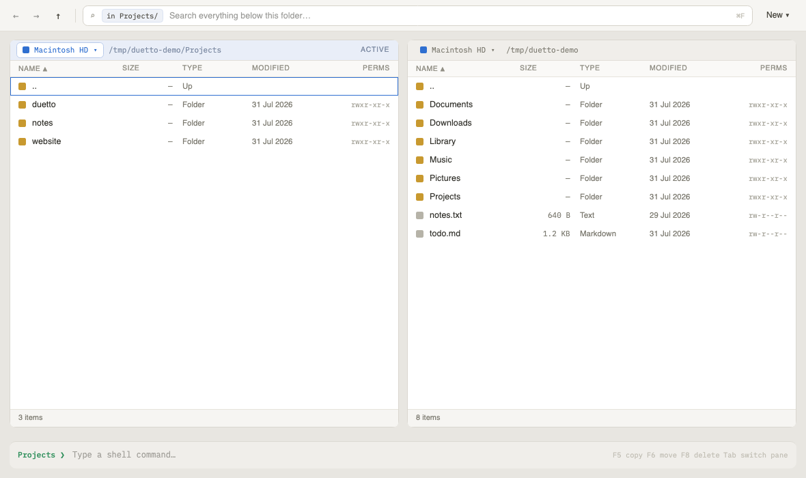
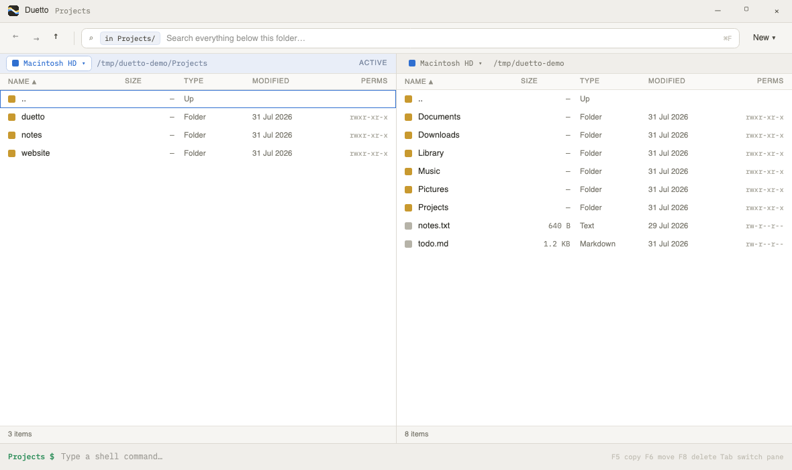
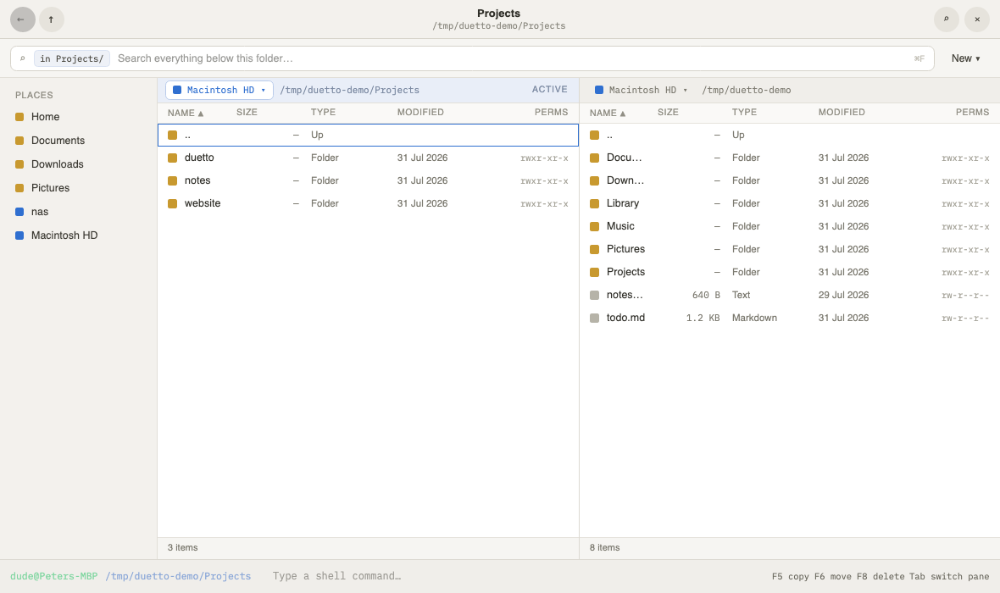

<div align="center">


# Duetto

**A fast, keyboard-driven dual-pane file manager for Windows, macOS, and Linux.**

[](LICENSE)
[](https://github.com/UtopleMan/duetto/actions/workflows/ci.yml)
[](https://github.com/UtopleMan/duetto/releases/latest)
[](https://github.com/UtopleMan/duetto/releases)

</div>

Two panes, everything on the keyboard, and a window that feels native on every
desktop. Copy and move between panes, browse remote servers over SFTP, search in
an instant, and delete straight to the system trash.

## Quick install

**macOS** - via [Homebrew](https://brew.sh):

```sh
brew install --cask utopleman/duetto/duetto
```

**Windows / Linux** - grab the latest build from the
[**Releases**](https://github.com/UtopleMan/duetto/releases/latest) page.

Duetto is unsigned, so macOS blocks it on first launch: right-click the app and
choose **Open**, or run `xattr -dr com.apple.quarantine "/Applications/Duetto.app"`.
See [Install](#install) below for all download options.

<div align="center">

### macOS


### Windows


### Linux


</div>

## Features

- **Dual-pane, keyboard-first** - view (`F3`), copy (`F5`), move (`F6`), delete
  (`F8`), rename (`F2`), new file/folder (`F7`); `Tab` switches panes, `Enter`
  opens, `Backspace` goes up.
- **Built-in file viewer** - `F3` on the cursor file (or a search result) opens a
  reusable viewer window: text with line numbers, a hex dump for binaries, and
  images rendered inline. Works over every backend, local and remote.
  `Ctrl`/`Cmd+F` finds within the file, `n`/`N` step through matches, `W` toggles
  word wrap, `Esc` closes. Limits: the first 4 MB of a text or binary file is
  shown (with a footer notice and an **Open in default app** action), and images
  up to 64 MB are decoded - anything larger falls back to a hex dump.
- **Native on every OS** - the window chrome adapts to Windows, macOS, and GNOME.
- **Remote over SFTP** - save connections and browse or transfer files over SSH,
  with trust-on-first-use host-key verification.
  ([setup & security](docs/remote-sftp.md))
- **Remote over SMB / Samba** - connect to Windows shares and NAS boxes (SMB 2/3)
  with a pure-managed client; user/password/domain or guest, share browsing.
  ([setup & security](docs/remote-smb.md))
- **Remote over S3** - connect to Amazon S3 and S3-compatible stores (MinIO, R2,
  Wasabi, B2); access keys, AWS profile, or anonymous; the root lists your buckets.
  ([setup & security](docs/remote-s3.md))
- **Remote over Azure Blob** - connect to Azure Blob Storage and Blob-compatible
  services (Azurite); account key, connection string, SAS, or anonymous; the root
  lists your containers. ([setup & security](docs/remote-azure.md))
- **Instant search** - recursive, scoped to the current folder or a remote share.
- **Safe deletes** - everything goes to the system trash: the Recycle Bin on
  Windows, the FreeDesktop trash on Linux, and the native macOS trash (with
  *Put Back* and correct handling of other volumes).
- **Remembers your workspace** - window position, size, and maximized state, plus
  each pane's last folder, restored on the next launch.
- **Command line** - `duetto [folder]` opens a folder in the left pane; a `duetto`
  launcher installs itself on your `PATH` the first time you run the app.

## Install

Download the latest build for your platform from the
[**Releases**](https://github.com/UtopleMan/duetto/releases/latest) page:

| Platform | Download |
| --- | --- |
| Windows (x64) | `duetto-<version>-win-x64.zip` |
| macOS (Apple Silicon) | `Duetto-<version>-arm64.dmg`, `duetto-<version>-osx-arm64.zip` |
| macOS (Intel) | `Duetto-<version>-x64.dmg`, `duetto-<version>-osx-x64.zip` |
| Linux (x64) | `duetto-<version>-linux-x64.zip` |

Builds are self-contained - no runtime to install.

**macOS** builds are unsigned. On first launch, right-click the app and choose
**Open**, or clear the quarantine flag:

```sh
xattr -dr com.apple.quarantine /Applications/Duetto.app
```

**Command line:** after launching once, `duetto` is on your `PATH`:

```sh
duetto .            # open the current directory
duetto ~/Projects   # open a specific folder
```

## Build from source

Requires the [.NET 10 SDK](https://dotnet.microsoft.com/download).

```sh
dotnet run --project src/Duetto                       # run the app
dotnet test tests/Duetto.Tests/Duetto.Tests.csproj    # run the tests

scripts/publish-all.sh          # self-contained zips for all platforms
scripts/make-dmg.sh osx-arm64   # macOS .dmg (osx-arm64 | osx-x64)
```

See [CONTRIBUTING.md](CONTRIBUTING.md) for more, and
[docs/remote-sftp.md](docs/remote-sftp.md) for SFTP details.

## License

[MIT](LICENSE) © 2026 UtopleMan
